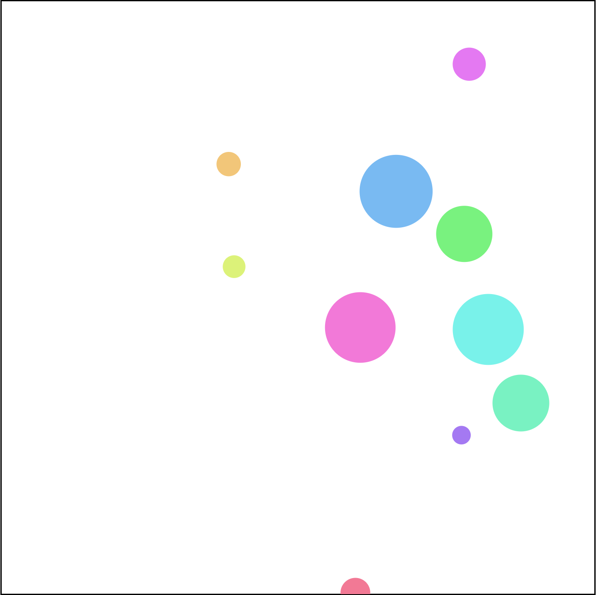

# hackberlin-workshop

**A workshop on building Frontend apps.**

Hey *Local Hackday Berlin* people! This is the source code of my workshop. It's also all you need to get started building web applications. If you need any help, head over to the [Gitter channel](https://gitter.im/derhuerst/hackberlin-workshop).



[](https://travis-ci.org/derhuerst/hackberlin-workshop)
[](https://ci.appveyor.com/project/derhuerst/hackberlin-workshop)
[](https://david-dm.org/derhuerst/hackberlin-workshop)
[](https://david-dm.org/derhuerst/hackberlin-workshop#info=devDependencies)

[](https://gitter.im/derhuerst/hackberlin-workshop)


## Installing

**You need to have Node.js installed.** On Mac type `brew install node`, on Linux follow [these instructions](https://github.com/nodesource/distributions#debian-and-ubuntu-based-distributions) and on Windows follow [these](https://nodejs.org/en/).

Check your Node.js & npm version before beginning:

```shell
node -v # should be >= 6
npm -v # should be >= 3
```

To install this boilerplate:

```shell
git clone https://github.com/derhuerst/hackberlin-workshop.git
cd hackberlin-workshop
npm install
```

## Getting Started

**To get started working on your game, keep `npm start` running in your terminal. Open `index.html` in your browser.** You can now edit `index.js` and, after reloading in the Browser, see what it looks like.

- `index.js` contains all the game logic. It is the file I wrote in during the presentation.
- `index.html` is the HTML page that the browser loads. It works like a frame for the game.
- The command `npm run build` takes `index.js`, packages everything up and puts it into `bundle.js`, so that the browser can use it.
- The command `npm start` is like `npm run build`, but it watches all files regenerates `bundle.js` whenever you edit something.

## Things to Build

- peer-to-peer chess game
- Super-Mario-style side runner
- [Bezier curve](https://en.wikipedia.org/wiki/Bézier_curve) editor
- visualize the [average age in the states of Berlin](http://daten.berlin.de/datensaetze/einwohnerinnen-und-einwohner-den-ortsteilen-berlins-am-31122015)
- visualize the [share of AFD electors in the states of Berlin](http://daten.berlin.de/datensaetze/wahlen-berlin-2016-abgeordnetenhaus-und-bezirksverordnetenversammlungen-endgültiges)
